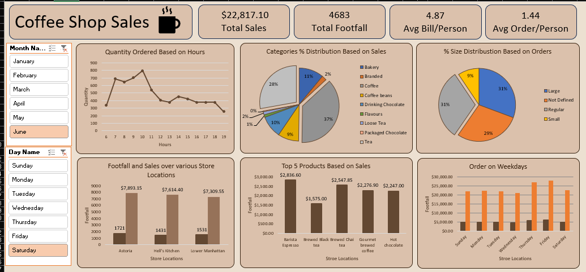

# Coffee Shop Sales Performance Analysis

## Project Overview
This project presents an end-to-end data analysis of a retail coffee shop chain operating across multiple New York City locations. Utilizing an enterprise dataset comprising 149,116 transaction records, this analysis evaluates macro-level performance metrics, operational efficiency, and product portfolio distribution to deliver data-driven business insights.

## Dashboard Preview

## Core Business Questions Addressed
The analytical framework of this project directly resolves the core business objectives outlined in the project brief:
1. **Sales Performance:** How have overall coffee shop sales trended over time across the observed six-month period?
2. **Operational Footfall:** Which specific hours of the day experience peak transactions, and how can this inform optimal staffing patterns?
3. **Weekly Volume Analysis:** Which days of the week tend to be the busiest for customer traffic?
4. **Product Mix Evaluation:** Which broad product categories and specific sizes drive the largest share of transactional volume?
5. **Revenue Optimizers:** Which specific menu items sold generate the highest total revenue for the business?

## Technical Competencies Demonstrated
* **Data Transformation:** Cleaned and standardized raw transaction timestamps, unit prices, and category fields to ensure total data integrity across the rows.
* **Feature Engineering:** Extracted operational variables including hour, day of the week, and month parameters from the raw transactional datetime records.
* **Data Aggregation:** Constructed multi-dimensional Pivot Tables to parse granular records into business-ready summary tables.
* **Interface Architecture:** Designed a functional executive dashboard utilizing dynamic cross-filtering Slicers and high-level calculated KPI metrics.

## Executive Insights Delivered
* **Macro Performance:** Total Sales reached $6,98,812.33 across 149,116 total customer footfall transactions. The average bill size per customer stands at $4.69, with an average order size of 1.44 units.
* **Hourly Traffic Patterns:** Transaction volume builds rapidly starting at 6:00 AM, spiking into an operational morning rush between 8:00 AM and 10:00 AM before stabilizing into an afternoon baseline.
* **Product Mix Strategy:** Coffee and Tea dominate consumer demand, accounting for 39% and 28% of overall sales distribution. Transaction orders lean heavily toward Regular (31%) and Large (30%) size options.
* **Location Analytics:** Revenue is distributed balanced across the three primary footprints, led by Hell's Kitchen ($2,36,511.17 in sales across 50,735 transactions), followed closely by Astoria and Lower Manhattan.
* **Top Revenue Drivers:** Barista Espresso represents the highest-performing menu item, generating $91,406.20 in product sales.

## Repository Contents
* `Coffee Shop Sales.xlsx`: The source database housing the raw transaction records.
* `coffee shop sales dashboard.xlsx`: The presentation workbook containing data transformations, analytical pivot tables, and the interactive dashboard layout.
* `coffee_shop_preview.png.png`: High-resolution dashboard visualization asset used for documentation.
* `README.md`: Project summary and portfolio documentation.
